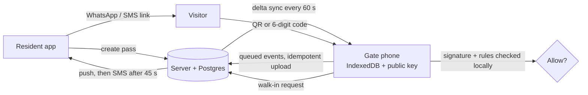

# OpenSesma

Gate access for African residential estates. Residents send visitors a code on WhatsApp; the guard checks it in seconds on a cheap Android phone — **even when the gatehouse has no light or data**. Nobody calls the gate.

Built from the [MVP, Features & PRDs doc](https://claude.ai/code/artifact/eaf0a96e-8e2b-4ff1-ae80-7e30258dec32). This repository is the MVP: access control.

| Who | Where | What they do |
| --- | --- | --- |
| Residents | `/app` (any phone browser, installable) | Create guest, delivery, artisan, multi-day, party and staff passes; share on WhatsApp/SMS; approve walk-ins with one tap; see who came and went |
| Visitors | `/p/<pass>` link | See their QR + 6-digit code. No app, no login, no JavaScript — a few KB |
| Guards | `/gate` on the gate phone | Scan QR or type the code; ALLOW / DENY full-screen; check in/out; ask a resident about a walk-in; override with a logged reason. **Works offline.** |
| Estate manager | `/admin` | Import houses from a spreadsheet, approve residents, add guards and gate phones, gate log + CSV export, reports, ban list, dues status and levy rule |

## How it works offline

Every pass is an Ed25519-signed token. Each gate phone holds the estate's **public** key plus a local copy of active passes, houses, guards (PIN hashes) and the ban list in IndexedDB. Verification, check-ins and the "inside now" list all run on the phone. Events queue locally and upload idempotently when the connection returns; if two offline gates admit the same one-time pass, the server flags it as a double entry for the manager.



The decision function (`src/lib/shared/evaluate.ts`) is shared by server and gate, so they can never disagree. See [docs/ARCHITECTURE.md](docs/ARCHITECTURE.md) for the full design and security model.

## Quick start

Requires Node 20+.

```bash
npm install
cp .env.example .env
npm run db:seed      # demo estate (uses an embedded Postgres in ./.data — no install needed)
npm run dev          # http://localhost:5173
```

Demo accounts (OTP codes appear on screen in development; every SMS is visible at `/dev/outbox`):

| Role | Sign in with | Then |
| --- | --- | --- |
| Estate manager | 0803 000 0001 | `/admin` |
| Resident, 14 Adeyemi St | 0803 000 0002 | `/app` |
| Guards | — | Open `/gate`, enter the setup code printed by the seed, pick **Sunday Okon** (PIN `1234`) |

Starting from scratch instead? Skip the seed and open `/setup` to create your estate.

## Deploying to Netlify

1. Push this repo to GitHub and **Add new site → Import from Git** in Netlify. The build settings come from `netlify.toml`.
2. Add a database: **Extensions → Netlify DB** (Neon Postgres; sets `NETLIFY_DATABASE_URL`) — or set `DATABASE_URL` to any Postgres 14+.
3. Set environment variables (Site settings → Environment variables):

   | Variable | Value |
   | --- | --- |
   | `APP_SECRET` | 32+ random characters. **Never change it after launch** — it encrypts each estate's signing key |
   | `PUBLIC_APP_URL` | Your site URL, e.g. `https://opensesma.netlify.app` |
   | `SMS_DRIVER` | `termii` |
   | `TERMII_API_KEY`, `TERMII_SENDER_ID` | From your [Termii](https://termii.com) dashboard (sender ID must be approved) |
   | `TERMII_CHANNEL` | `dnd` so OTPs reach DND-enabled numbers |
   | `VAPID_PUBLIC_KEY`, `VAPID_PRIVATE_KEY`, `VAPID_SUBJECT` | `npm run keys:vapid` |
   | `CRON_SECRET` | Random string; enables the daily data-retention job |
   | `SETUP_TOKEN` | Optional. Lets you open `/setup?token=…` to onboard more estates |

4. Deploy. Migrations run automatically before each build. Open `/setup` to create the first estate.

Self-hosting on a VPS works too: `ADAPTER=node npm run build && node build` (set `ORIGIN`, plus `DATABASE_URL`, or `DATABASE_URL=pglite://./.data/pglite` for a single-server install).

## Setting up a gate

1. Admin → **People** → add each guard with a 4-digit PIN.
2. Admin → **Gate phones** → *Add a phone* for each gate. Note the setup code.
3. On the gate phone (Android 8+, Chrome): open `https://<your-site>/gate`, add it to the home screen, enter the setup code.
4. Keep it on a power bank. It works without data; it only needs a connection now and then to receive new passes and send its log.

## Development

```bash
npm test          # 48 tests: pass engine, server flows on embedded Postgres, gate engine offline
npm run check     # svelte-check / TypeScript
npm run db:generate   # after editing src/lib/server/db/schema.ts
```

```
src/lib/shared/     isomorphic: pass tokens, decision rules, PIN hashing, phone/time formatting
src/lib/server/     auth (OTP), estates, passes, gate sync/ingest/walk-ins, admin queries, SMS, push
src/lib/client/gate offline engine + IndexedDB store for the guard console
src/routes/app      resident app       src/routes/gate   guard console (static, cached by the service worker)
src/routes/admin    estate manager     src/routes/p      visitor pass page (no JS)
```

Stack: SvelteKit 2 + Svelte 5, Drizzle ORM on Postgres (PGlite in dev/tests), `@noble/curves` Ed25519, Web Push, Termii SMS. System fonts only and ~116 KB of gzipped JS across the whole app, because data is expensive.

## Roadmap (from the PRD)

- **V2:** levy payments (Paystack/Flutterwave), WhatsApp Business API delivery, vehicle plates, visitor photos, overstay alerts, guard shift handover, Pidgin/Yoruba/Hausa/Igbo UI, estate announcements
- **V3:** boom barrier / turnstile integration, USSD for feature-phone residents, multi-estate facility managers, facility booking
