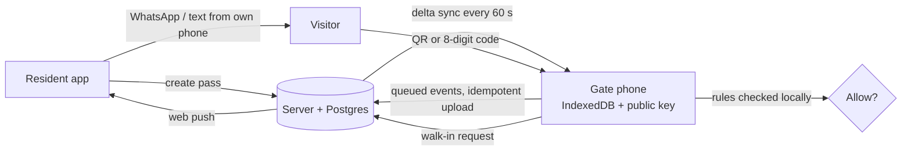

# OpenSesma

Gate access for African residential estates. Residents send visitors a code on WhatsApp or by text from their own phone; the guard checks it in seconds on a cheap Android phone — **even when the gatehouse has no light or data**. Nobody calls the gate, and the app sends no paid messages.

Built from the [MVP, Features & PRDs doc](https://claude.ai/code/artifact/eaf0a96e-8e2b-4ff1-ae80-7e30258dec32). This repository is the MVP: access control.

| Who | Where | What they do |
| --- | --- | --- |
| Residents | `/app` (any phone browser, installable) | Create guest, delivery, artisan, multi-day, party and staff passes; send them with **WhatsApp** or **Text message** buttons; approve walk-ins with one tap; see who came and went |
| Visitors | Short link `/v/<id>` → `/p/<pass>` | See their QR and 8-digit code. No app, no login, no JavaScript — a few KB |
| Guards | `/gate` on the gate phone | Start a shift with a 6-digit PIN; scan QR or type the code; ALLOW / DENY full-screen; check in/out; ask a resident about a walk-in; override with a logged reason. **Works offline.** No sign-in needed |
| Estate manager | `/admin` | Add or import houses and send invites, manage people and sign-in links, gate phones, gate log + CSV export, reports, ban list, dues status and levy rule |

## How it works offline

Every pass is an Ed25519-signed token. Each gate phone holds the estate's **public** key plus a local copy of active passes (without signatures), houses, guards (PIN hashes) and the ban list in IndexedDB — but no phone numbers. Verification, check-ins and the "inside now" list all run on the phone. Events queue locally and upload idempotently when the connection returns. The server re-checks every uploaded entry at server time and flags anything that doesn't add up (double entries, cancelled or expired passes, wrong phone clocks) for the manager.



The decision function (`src/lib/shared/evaluate.ts`) is shared by server and gate, so they can never disagree. See [docs/ARCHITECTURE.md](docs/ARCHITECTURE.md) for the full design and security model, and [docs/security/](docs/security/) for the security assessment.

## Signing in (no SMS needed)

The MVP has no SMS provider. People sign in with **one-time links** that the estate manager sends on WhatsApp or by text:

| Who | How they get in |
| --- | --- |
| Estate manager | The private setup link `/setup?token=<SETUP_TOKEN>` creates the estate, or signs an existing manager back in on a new phone |
| New resident | Manager adds the house with their phone number → sends the invite → resident taps **Join and sign in** |
| Household member | Head of household invites them from **Household** in the app, same way |
| Anyone on a new phone | Manager → **People** → **Sign-in link** next to their name → sends it |
| Guards | No sign-in. The gate phone is set up once with a code; guards use their PIN |

Links work once and expire (sign-in links after 3 days, invites after 14). Opening a link only shows a page; signing in needs a tap, so WhatsApp's link preview can't use it up.

Text-message login codes are still built in. If you later set `SMS_DRIVER=termii` and `TERMII_API_KEY`, the login page offers codes again and the estate-wide join link reappears.

## Quick start

Requires Node 20+.

```bash
npm install
cp .env.example .env
npm run db:seed      # demo estate (uses an embedded Postgres in ./.data — no install needed)
npm run dev          # http://localhost:5173
```

In development, login codes are shown on screen and every message is visible at `/dev/outbox`.

| Role | Sign in with | Then |
| --- | --- | --- |
| Estate manager | 0803 000 0001 | `/admin` |
| Resident, 14 Adeyemi St | 0803 000 0002 | `/app` |
| Guards | — | Open `/gate`, enter the setup code printed by the seed, pick **Sunday Okon** (PIN `123456`) |

Starting from scratch instead? Skip the seed and open `/setup` to create your estate.

## Deploying to Netlify

1. Push this repo to GitHub and **Add new site → Import from Git** in Netlify. The build settings come from `netlify.toml`.
2. Database: nothing to do. Because `@netlify/database` is installed, Netlify provisions **Netlify Database** (Postgres) on the first deploy and applies `netlify/database/migrations/` just before each deploy is published. Also add the connection string as the `DATABASE_URL` secret (Data & Storage → Database → Copy connection string): the SvelteKit function runs in a mode where Netlify doesn't inject it.
3. Set environment variables (Site settings → Environment variables):

   | Variable | Value |
   | --- | --- |
   | `APP_SECRET` | Secret. 32+ random characters; encrypts each estate's signing key. Rotate only with `APP_SECRET_PREVIOUS` + `npm run secrets:rotate` |
   | `DATABASE_URL` | Secret. The Netlify Database connection string |
   | `SETUP_TOKEN` | Secret. Random string; opens `/setup?token=…`. Whoever has it can create estates and sign in as any manager — keep it private |
   | `CRON_SECRET` | Secret. Random string; enables the daily data-retention job and detailed `/api/health` |
   | `VAPID_PUBLIC_KEY`, `VAPID_PRIVATE_KEY`, `VAPID_SUBJECT` | `npm run keys:vapid` (private key as a secret) |
   | `PUBLIC_APP_URL` | Your site URL, e.g. `https://opensesma.netlify.app` |
   | `SMS_DRIVER` | `console` (no SMS — the default for the MVP) |
   | `SMS_DRIVER=termii`, `TERMII_API_KEY`, `TERMII_SENDER_ID`, `TERMII_CHANNEL=dnd` | Optional. Turns on text-message login codes |
   | `ALLOWED_COUNTRY_CODES`, `OTP_PER_IP_PER_HOUR`, `OTP_GLOBAL_PER_HOUR` | Optional, only with SMS on. Defaults `234`, 10 and 300 — SMS-cost protection |

4. Deploy, then check `/api/health` says `{"ok":true}` (add `Authorization: Bearer <CRON_SECRET>` for details).
5. Open `/setup?token=<SETUP_TOKEN>` and create the estate. Tick **Add a test house, resident and guard** to try everything straight away: the dashboard shows the steps.
6. Turn off Netlify's team login (if it's on) so residents and guards can open the site.

Self-hosting on a VPS works too: `ADAPTER=node npm run build && node build` (set `ORIGIN`, plus `DATABASE_URL`, or `DATABASE_URL=pglite://./.data/pglite` for a single-server install).

## Setting up a gate

1. Admin → **People** → add each guard with a 6-digit PIN.
2. Admin → **Gate phones** → *Add a phone* for each gate. Note the setup code (it works once, for 24 hours).
3. On the gate phone (Android 8+, Chrome): open `https://<your-site>/gate`, add it to the home screen, enter the setup code.
4. Keep it on a power bank. It works without data; it only needs a connection now and then to receive new passes and send its log.

## Development

```bash
npm test          # 108 tests: pass engine, server flows on embedded Postgres, offline gate engine, sign-in links, and a regression test for every security finding
npm run check     # svelte-check / TypeScript — keep it at 0 errors, 0 warnings
npm run db:generate -- --name <what_changed>   # after editing src/lib/server/db/schema.ts — also copies the SQL to netlify/database/migrations/
                                               # never edit or delete a migration once deployed; Netlify rejects it
```

```
src/lib/shared/     isomorphic: pass tokens, decision rules, 8-digit codes, PIN hashing, safe redirects, formatting
src/lib/server/     auth (sessions, optional SMS codes), sign-in links, estates, passes, gate sync/ingest/walk-ins, admin, push
src/lib/client/gate offline engine + IndexedDB store for the guard console
src/routes/app      resident app       src/routes/gate   guard console (static, cached by the service worker)
src/routes/admin    estate manager     src/routes/p, v   visitor pass page (no JS) and its short link
src/routes/l, join  sign-in and invite links          src/routes/setup  token-gated estate setup / manager sign-in
```

Stack: SvelteKit 2 + Svelte 5, Drizzle ORM on Postgres (PGlite in dev/tests), `@noble/curves` Ed25519, Web Push. System fonts only and a small JS bundle, because data is expensive.

Project skills for AI-assisted work live in `.claude/skills/` (product requirements, engineering guide, security model).

## Roadmap (from the PRD)

- **V2:** visitor photos and photo bans, vehicle plates, overstay alerts, guard shift handover and SOS, Pidgin/Yoruba/Hausa/Igbo UI, estate announcements, levy payments (Paystack/Flutterwave), WhatsApp Business API
- **V3:** boom barrier / turnstile integration, USSD for feature-phone residents, multi-estate facility managers, facility booking
